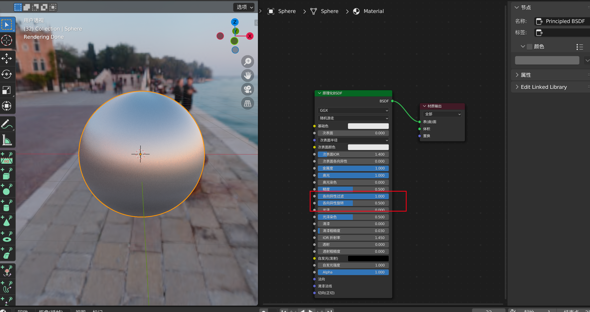

# ⛽ 挤出选区

挤出工具会复制顶点，但保持新几何元素与原始顶点相连，原来的顶点变成边，而边变成面。

<figure><figcaption></figcaption></figure>

<figure><figcaption></figcaption></figure>

挤出面， 复制面，同时保持新几何体与原始顶点连接。

挤出选区默认面沿着其<mark style="color:red;">**平均法线**</mark>挤压。  如果选中多个面的话，blender会计算[<mark style="color:red;">**平均法线**</mark>](https://docs.blender.org/manual/zh-hans/2.90/modeling/meshes/editing/mesh/normals.html#average)。

红色箭头指向的绿色代表每一个面的法向

黄色是blender计算出的两个面的平均法线

<figure><figcaption></figcaption></figure>
