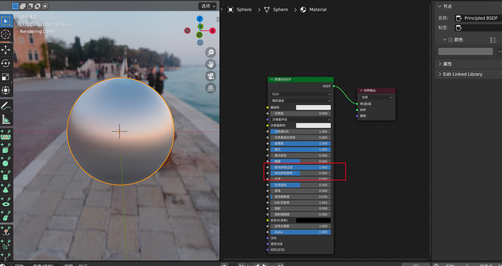

# 😗 如何彻底删除材质？

点击材质按钮的 ➖ 只能是删除当前的材质位，并不会删除材质本身

<figure><figcaption></figcaption></figure>

如果想要彻底删除某个材质， 选择右上角显示模式，并且选择 blender 文件，右键某个材质，然后选择删除

<figure><figcaption></figcaption></figure>

<figure><figcaption></figcaption></figure>

